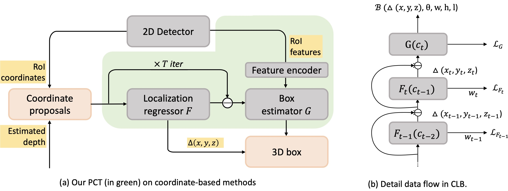

## Progressive Coordinate Transforms for Monocular 3D Object Detection

This repository is the official implementation of [PCT](https://arxiv.org/abs/2108.05793).

#### Introduction

In this paper, we propose a novel and lightweight approach, dubbed Progressive Coordinate Transforms (PCT) to facilitate learning coordinate representations for monocular 3D object detection. Specifically, a localization boosting mechanism with confidence-aware loss is introduced to progressively refine the localization prediction. In addition, semantic image representation is also exploited to compensate for the usage of patch proposals. Despite being lightweight and simple, our strategy allows us to establish a new state-of-the-art among the monocular 3D detectors on the competitive KITTI benchmark. At the same time, our proposed PCT shows great generalization to most coordinate-based 3D detection frameworks.





## Requirements

#### Installation

Download this repository (tested under python3.7, pytorch1.3.1 and ubuntu 16.04.7).  There are also some dependencies like `cv2, yaml, tqdm, etc.`, and please install them accordingly:
```sh
cd #root
pip install -r requirements
```

 Then, you need to compile the evaluation script:

```sh
cd root/tools/kitti_eval
sh compile.sh
```

#### Prepare your data

First, you should download the [KITTI dataset](http://www.cvlibs.net/datasets/kitti/eval_object.php?obj_benchmark=3d), and organize the data as follows  (`*` indicates an empty directory to store the data generated in subsequent steps):
```

#ROOT
  |data
    |KITTI
      |2d_detections
      |ImageSets
      |pickle_files *
      |object
        |training
          |calib
          |image_2
          |label
          |depth *
          |pseudo_lidar (optional for Pseudo-LiDAR)*
          |velodyne (optional for FPointNet)
        |testing
          |calib
          |image_2
          |depth *
          |pseudo_lidar (optional for Pseudo-LiDAR)*
          |velodyne (optional for FPointNet)
```

Second, you need to prepare your depth maps and put them to `data/KITTI/object/training/depth`. For ease of use, we also provide the estimated depth maps (these data generated from the pretrained models provided by [DORN](https://github.com/hufu6371/DORN) and [Pseudo-LiDAR](https://github.com/mileyan/pseudo_lidar)).

| Monocular (DORN)  | Stereo (PSMNet) |
| ---------------- | ------- |
| [trainval(~1.6G)](https://drive.google.com/file/d/1VLG8DbjBnyLjo2OHmrb3-usiBLDcH7JF/view?usp=sharing), [test(~1.6G)](https://drive.google.com/file/d/1dL0vE-2ur031tJ01KYp4qtifxYWcQSN5/view?usp=sharing) | [trainval(~2.5G)](https://drive.google.com/file/d/1CIHsBwBTtAZxKlGJ5jS41OXySNXiqBIF/view?usp=sharing) |

Then, you need to generate image 2D features for the 2D bounding boxes and put them to `data/KITTI/pickle_files/org`. We train the 2D detector according to the 2D detector in [RTM3D](https://github.com/Banconxuan/RTM3D). You can also use your own 2D detector for training and inference.

Finally, generate the training data using provided scripts :

```sh
cd #root/tools/data_prepare
python patch_data_prepare_val.py --gen_train --gen_val --gen_val_detection --car_only
mv *.pickle ../../data/KITTI/pickle_files
```

#### Prepare Waymo dataset

We also provide [Waymo Usage](https://github.com/amazon-research/progressive-coordinate-transforms/tree/main/tools/waymo) for monocular 3D detection.


## Training

Move to the workplace and train the mode (also need to **modify the path of pickle files in config file**):

```sh 
 cd #root
 cd experiments/pct
 python ../../tools/train_val.py --config config_val.yaml
```


## Evaluation

Generate the results using the trained model:

```sh
 python ../../tools/train_val.py --config config_val.yaml --e
```

and evalute the generated results using:

```sh
../../tools/kitti_eval/evaluate_object_3d_offline_ap11 ../../data/KITTI/object/training/label_2 ./output
```
or
```sh
../../tools/kitti_eval/evaluate_object_3d_offline_ap40 ../../data/KITTI/object/training/label_2 ./output
```
we provide the generated results for evaluation due to the tedious process of data preparation process. Unzip the output.zip and then execute the above evaluation commonds. Result is:

| Models | AP3D11@mod. | AP3D11@easy| AP3D11@hard|
| -------- | ------- | -------- | ------- |
| PatchNet + PCT| 27.53 / 34.65 | 38.39 / 47.16 | 24.44 / 28.47 |


## Acknowledgements

This code benefits from the excellent work [PatchNet](https://github.com/xinzhuma/patchnet), and use the off-the-shelf models provided by [DORN](https://github.com/hufu6371/DORN) and [RTM3D](https://github.com/Banconxuan/RTM3D).


## Citation

```
@article{wang2021pct,
  title={Progressive Coordinate Transforms for Monocular 3D Object Detection},
  author={Li Wang, Li Zhang, Yi Zhu, Zhi Zhang, Tong He, Mu Li, Xiangyang Xue},
  journal={arXiv preprint arXiv:2108.05793},
  year={2021}
}
```


## Contact

For questions regarding PCT-3D, feel free to post here or directly contact the authors (wangli16@fudan.edu.cn).


## Security

See [CONTRIBUTING](CONTRIBUTING.md#security-issue-notifications) for more information.


## License

This project is licensed under the Apache-2.0 License.
